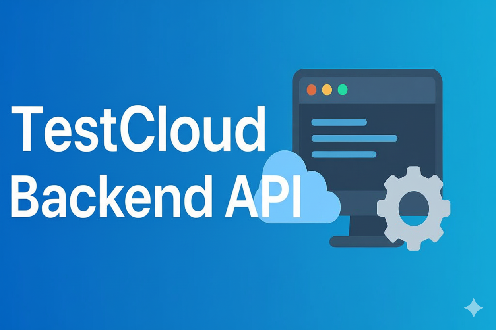

 # TestCloud Backend




An **Express.js + MongoDB backend** for **TestCloud**, a QA software testing platform.  
It powers **test management**, **defect tracking**, **user authentication**, and **email notifications**.

---

## ✨ Features

- **User Authentication** – Secure JWT auth, email verification, and password reset
- **Test Management** – CRUD APIs for Test Plans and Test Cases
- **Defect Tracking** – Bug reports with status updates
- **Role-Based Access Control** – Tester, Lead, and Admin roles
- **Email Notifications** – Welcome, verification, and password reset emails

---

## 🛠 Tech Stack

- **Backend:** [Express.js](https://expressjs.com/)
- **Database:** [MongoDB](https://www.mongodb.com/) + Mongoose
- **Authentication:** [JWT](https://jwt.io/) (HTTP-only cookies)
- **Email Service:** [Mailtrap](https://mailtrap.io/) + Nodemailer
- **Security:** Helmet, CORS, Bcrypt

---

## 📂 Project Structure

```bash
config/         # DB connection
controllers/    # API logic
mailtrap/       # Email templates & config
middleware/     # Error handling & token verification
models/         # Mongoose models
routes/         # Express routes
utils/          # Utility functions
postman/        # Postman API collection
server.js       # Entry point
````

---

## 🚀 Getting Started

### 1. Clone the Repository

```bash
git clone https://github.com/bahatijacklee/qa-backend.git
cd qa-backend
```

### 2. Install Dependencies

```bash
npm install
```

### 3. Configure Environment Variables

Create a `.env` file in the root directory:

```env
PORT=5000
MONGO_URI=mongodb://localhost:27017/testcloud
JWT_SECRET=your_jwt_secret
MAILTRAP_ENDPOINT=smtp.mailtrap.io
MAILTRAP_TOKEN=your_mailtrap_token
CLIENT_URL=http://localhost:3000
NODE_ENV=development
```

---

## ▶️ Run the Server

### Development

```bash
npm run dev
```

### Production

```bash
npm start
```

---

## 📡 API Endpoints

### Authentication

* `POST /api/auth/signup` – Register
* `POST /api/auth/verify-email` – Verify email
* `POST /api/auth/login` – Login
* `POST /api/auth/logout` – Logout
* `POST /api/auth/forgot-password` – Request password reset
* `POST /api/auth/reset-password/:token` – Reset password
* `GET /api/auth/check-auth` – Verify session

### Test Plans

* `GET /api/testplans` – Get all test plans
* `POST /api/testplans` – Create test plan
* `GET /api/testplans/:id` – Get test plan by ID
* `PUT /api/testplans/:id` – Update test plan
* `DELETE /api/testplans/:id` – Delete test plan

### Test Cases

* `GET /api/testcases` – Get all test cases
* `POST /api/testcases` – Create test case
* `GET /api/testcases/:id` – Get test case by ID
* `PUT /api/testcases/:id` – Update test case
* `DELETE /api/testcases/:id` – Delete test case

### Defects

* `GET /api/defects` – Get defects
* `POST /api/defects` – Report defect
* `PATCH /api/defects/:id/status` – Update defect status

### Users (Admin)

* `GET /api/users` – Get all users
* `GET /api/users/:id` – Get user details
* `PATCH /api/users/:id/role` – Change user role

---

## 🧪 Postman Collection

A Postman collection is available in:

```
postman/QA-Backend-Auth-API.postman_collection.json
```

---

## 📜 License

This project is licensed under the [Apache 2.0 License](LICENSE). 
See [NOTICE](NOTICE) for attribution.

---

## 👨‍💻 Author

**Swiga Bahati**

[](https://github.com/bahatijacklee)
[](https://major-ledger.vercel.app)

